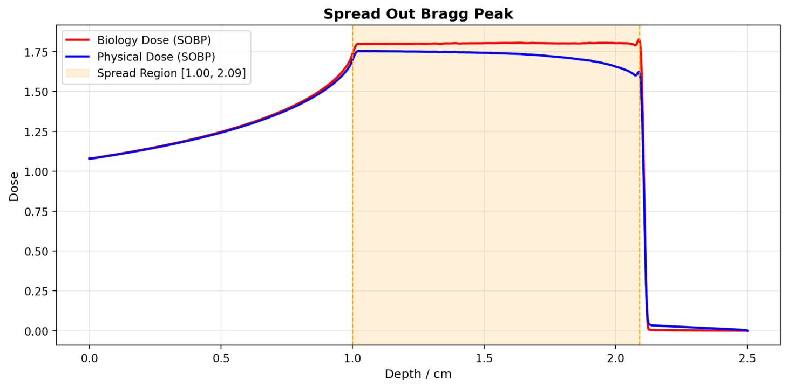
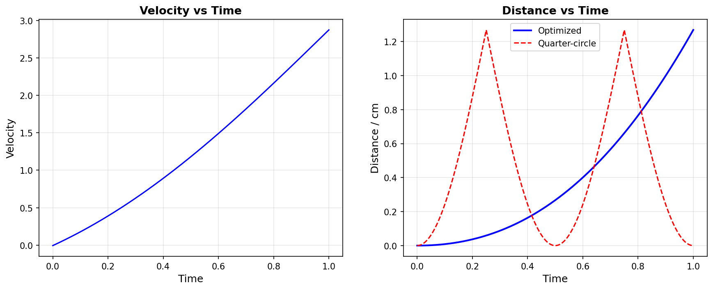
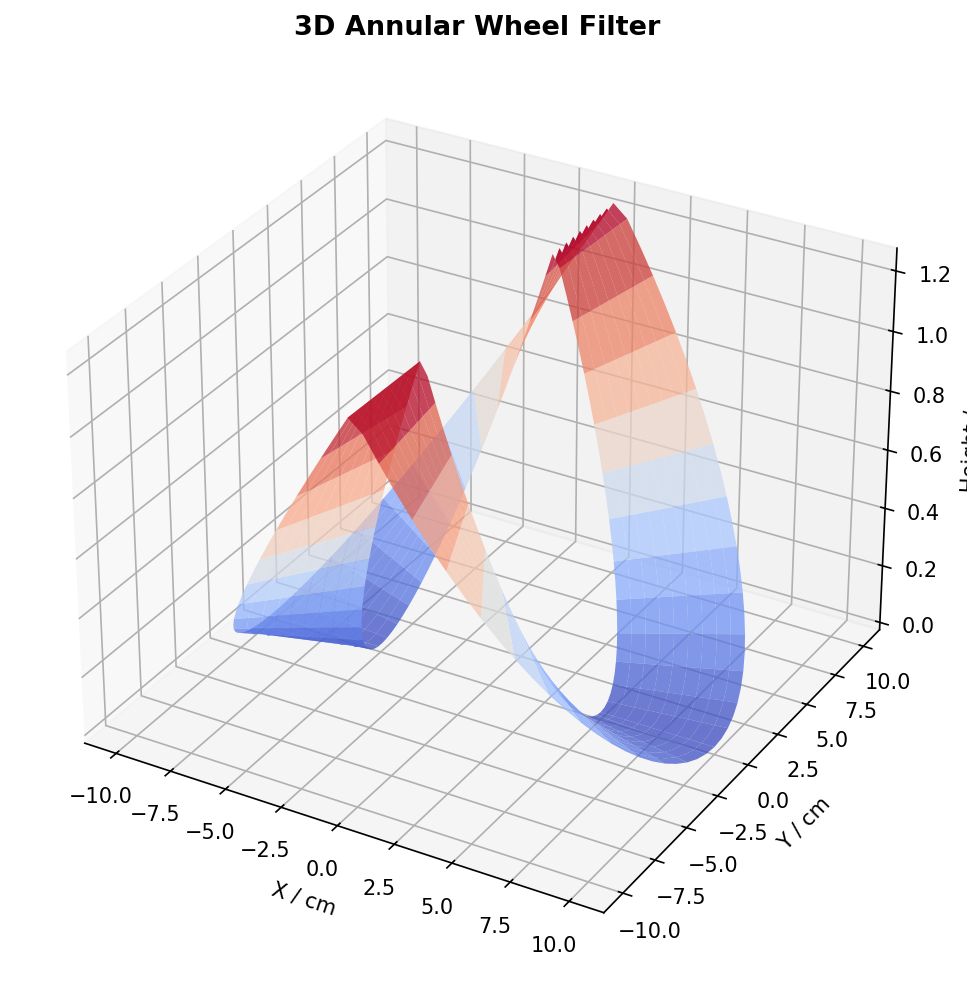
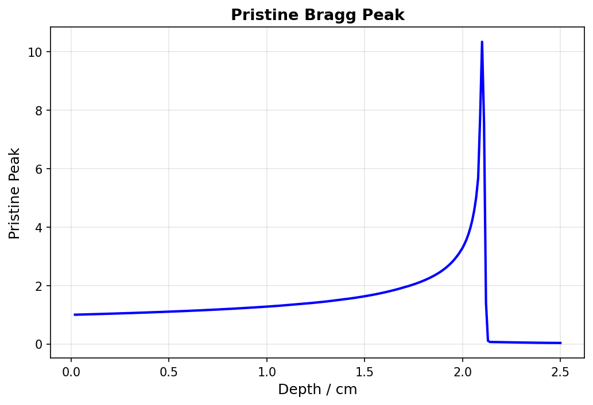
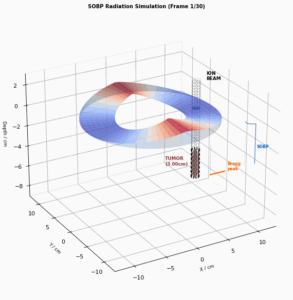

# Spread Out Bragg Peak (SOBP)

A Streamlit web application for optimizing and visualizing Spread Out Bragg Peak (SOBP) dose distributions in heavy ion radiotherapy.

## Features

- **Data Loading**: Demo data or upload custom BraggPeak/RBE files (xlsx/csv)
- **SOBP Optimization**: Nelder-Mead (fmin) optimization of 4th-order polynomial velocity function
- **Interactive Visualization**:
  - SOBP dose curves (biological & physical)
  - Velocity & Distance vs Time
  - 3D annular wheel filter
  - Quarter-circle distance comparison
- **3D Radiation Simulation**: Animated GIF showing ion beam passing through rotating wheel filter
  - Irregular tumor (flesh-colored ellipsoid)
  - Beam represented as dense dashed lines
  - Pristine Bragg peak curve (orange) moving with beam depth
  - SOBP plateau curve (blue) with rising edge
  - Shadow projection on ring surface

## Demo

### SOBP Dose Distribution


### Velocity & Distance vs Time


### 3D Annular Wheel Filter


### Pristine Bragg Peak


### Radiation Simulation


## Quick Start

1. Install dependencies:
   ```bash
   pip install -r requirements.txt
   ```

2. Run the app:
   ```bash
   streamlit run SOBP.py
   ```

3. Open browser at http://localhost:8508

## Reference

ZHOU Qing-Ming, ZHANG Hong, LI Qiang, WEI Li-Li, LIU Xin-Guo, GU Meng-Xia, WU Gui-Hong, DAI Zhong-Yin. Rotating wheel filter design and optimization for a uniform depth dose distribution in heavy ion therapy[J]. *Chinese Physics C*, 2008, 32(S2): 294-298.

## Contact

WeChat: icecoler
