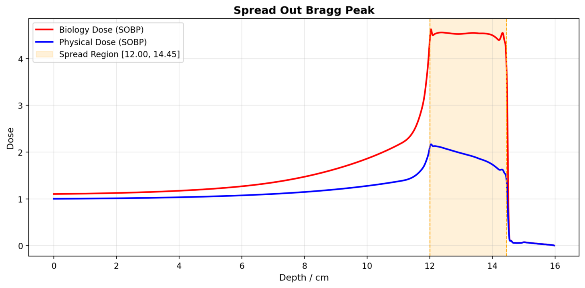
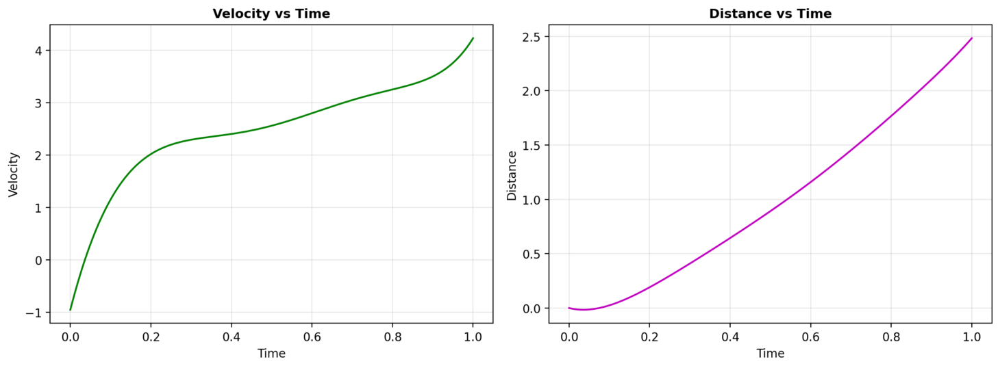
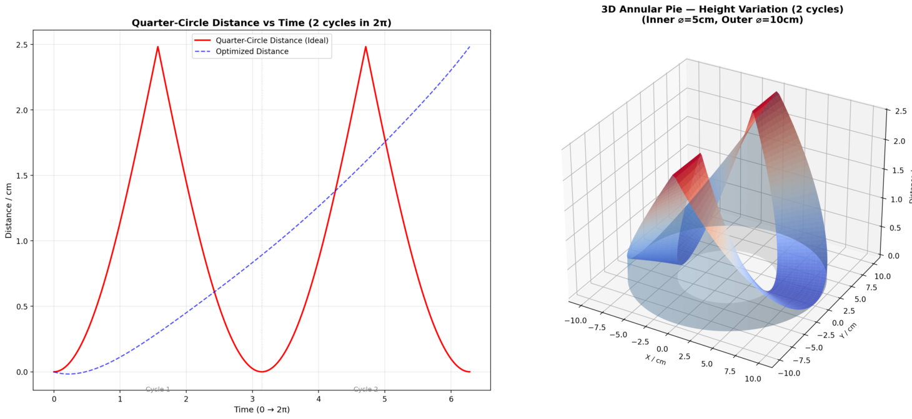

# Spread Out Bragg Peak (SOBP)

A Streamlit web application for optimizing and visualizing **Spread Out Bragg Peak (SOBP)** dose distributions in heavy ion radiotherapy.

**Online Demo**: http://114.55.108.215/SOBP/

---

## Table of Contents

- [What is SOBP?](#what-is-sobp)
- [Features](#features)
- [Screenshots](#screenshots)
- [Quick Start](#quick-start)
- [How to Use](#how-to-use)
- [Data Format](#data-format)
- [Core Formulas & Algorithm](#core-formulas--algorithm)
- [Objective Functions](#objective-functions)
- [Optimization Strategies](#optimization-strategies)
- [3D Visualization](#3d-visualization)
- [References](#references)
- [Contact](#contact)

---

## What is SOBP?

**Spread Out Bragg Peak (SOBP)** is a technique used in heavy ion radiotherapy to create a uniform dose distribution across a tumor volume.

A single pristine Bragg peak deposits maximum dose at a specific depth. By modulating the beam energy (i.e., varying the particle velocity over time), multiple Bragg peaks at different depths are superimposed to form a flat "plateau" — the SOBP — that covers the entire tumor thickness.

---

## Features

- **Data Loading**: Demo data or upload custom BraggPeak/RBE files (xlsx/csv)
- **SOBP Optimization**: Multi-strategy optimization of polynomial velocity function
  - 6 objective functions (Std, CV, DHI, MaxRelDev, Percentile, Combined)
  - 4 optimization strategies (Nelder-Mead, Multi-Start, Differential Evolution, Two-Stage)
- **Polynomial Velocity Function**: Configurable degree 1–6
- **Interactive Visualization**:
  - SOBP dose curves (biological & physical)
  - Velocity & Distance vs Time
  - 3D annular wheel filter
  - Quarter-circle distance comparison
- **3D Radiation Simulation**: Animated GIF showing ion beam passing through rotating wheel filter
- **Download Options**: PNG, GIF, MP4, Excel results

---

## Screenshots

### SOBP Dose Distribution


### Velocity & Distance vs Time


### 3D Model


---

## Quick Start

1. Install dependencies:
   ```bash
   pip install -r requirements.txt
   ```

2. Run the app:
   ```bash
   streamlit run SOBP.py
   ```

3. Open browser at http://localhost:8508

---

## How to Use

**Step 1 — Load Data:** In the sidebar, choose "Demo Data" (built-in example) or "Upload Files" to provide your own BraggPeak and RBE data files.

**Step 2 — Set Optimization Step:** Adjust the step size (default 0.01 cm). Smaller values give finer optimization but are slower. Output plots always use step=0.001 for fine resolution.

**Step 3 — Define Spread Width:** Set StartPoint and EndPoint (in cm) to define the SOBP plateau region.

**Step 4 — Choose Polynomial Degree:** Select velocity function degree (1–6, default 6). Higher degrees offer more flexibility.

**Step 5 — Select Objective Function:** Choose from 6 uniformity metrics (default: Standard Deviation).

**Step 6 — Select Optimization Strategy:** Choose from 4 strategies (default: Nelder-Mead fast).

**Step 7 — Run Optimization:** Click "Run Optimization". The app will find optimal velocity parameters.

**Step 8 — View Results:** Switch to the "Optimization Results" tab to see:
- Optimized velocity parameters
- SOBP dose curves (biological & physical)
- Velocity & Distance vs Time
- Quarter-circle distance comparison
- 3D annular pie visualization
- Platform flatness metrics
- Download options

**Step 9 — Simulation:** Switch to the "Simulation" tab and click "Generate Simulation" to create a 3D animated GIF of the radiation process.

---

## Data Format

**BraggPeak file** (xlsx/csv): Three columns — Depth (cm), Physical Dose (relative), LET (keV/μm).

| Depth/cm | Dose | LET (keV/μm) |
|----------|------|-------------|
| 0.00     | 1.00 | 10.0        |
| 0.01     | 1.01 | 10.1        |
| ...      | ...  | ...         |

*Legacy 2-column format (Depth, Dose) is also supported — LET will be assumed equal to Dose.*

**RBE file** (xlsx/csv): Two columns — LET (keV/μm) and RBE value.

| LET/keV | RBE |
|---------|-----|
| 10      | 1.2 |
| 20      | 1.5 |
| ...     | ... |

---

## Core Formulas & Algorithm

### (a) Velocity Function

The beam energy modulation is controlled by a polynomial velocity function:

$$v(t) = \sum_{i=0}^{n} a_i \cdot t^i = a_0 + a_1 t + a_2 t^2 + \cdots + a_n t^n$$

where $n$ is the polynomial degree (selectable: 1–6), and $a_i$ are the optimization parameters.

**Physical constraint**: velocity must be non-negative at all times (the Bragg peak cannot shift deeper than EndPoint):

$$v(t) \geq 0 \quad \forall t$$

### (b) Cumulative Distance (Range Shift)

At each time step $\Delta t$, the cumulative range shift is:

$$D_k = \sum_{j=0}^{k-1} v(t_j) \cdot \Delta t, \quad D_0 = 0$$

**Physical constraint**: the maximum range shift cannot exceed $z_{\text{end}} - z_{\text{start}}$, ensuring the shallowest Bragg peak does not move past StartPoint:

$$D_k \leq z_{\text{end}} - z_{\text{start}} \quad \forall k$$

### (c) Biological SOBP Dose

At time step $k$ with cumulative shift $D_k$, the Bragg peak shifts **toward shallower depth**. The biological dose contribution at depth $z$ is:

$$\text{dose}_{\text{bio}}(z, t_k) = D_{\text{phys}}(z + D_k) \times \text{RBE}\bigl(\text{LET}(z + D_k)\bigr) \times \Delta t$$

The total biological SOBP is the sum over all time steps:

$$\text{SOBP}_{\text{bio}}(z) = \sum_{k=0}^{N} D_{\text{phys}}(z + D_k) \times \text{RBE}\bigl(\text{LET}(z + D_k)\bigr) \times \Delta t$$

where:
- $D_{\text{phys}}(z)$ = physical dose of the pristine Bragg peak at depth $z$
- $\text{LET}(z)$ = linear energy transfer at depth $z$
- $\text{RBE}(\text{LET})$ = relative biological effectiveness, looked up from the RBE table via cubic spline interpolation
- $z + D_k$ is the "look-up depth": the original Bragg peak position that, after shifting by $D_k$, contributes to depth $z$

**Physical interpretation**: At $t=0$, $D_0=0$, the pristine peak is at its deepest position (EndPoint). As $D_k$ increases, the peak moves to shallower depths, so depth $z$ receives dose from progressively deeper portions of the original peak.

### (d) Physical SOBP Dose

Same as above but without the RBE weighting:

$$\text{SOBP}_{\text{phys}}(z) = \sum_{k=0}^{N} D_{\text{phys}}(z + D_k) \times \Delta t$$

### (e) Quarter-Circle Distance Reference

The idealized distance profile follows quarter-circle arcs:

$$D_{\text{ideal}}(\theta) = R \cdot \bigl|\sin(\theta)\bigr|$$

producing 2 symmetric peaks over $\theta \in [0, 2\pi]$, serving as a geometric reference for the optimized velocity-derived distance.

---

## Objective Functions

The optimization minimizes a uniformity metric of the biological dose within the platform region $[z_{\text{start}}, z_{\text{end}}]$. The available objective functions are:

**Standard Deviation (σ)** (default):

$$\min_{\{a_i\}} \; \text{Std}\Bigl[\text{SOBP}_{\text{bio}}(z) \Bigr]_{z \in [z_{\text{start}},\, z_{\text{end}}]}$$

**Coefficient of Variation (CV)** — normalized σ/μ, unitless:

$$\min_{\{a_i\}} \; \frac{\sigma}{\mu}$$

**Dose Homogeneity Index (DHI)** — clinical standard, penalizes worst-case spread:

$$\min_{\{a_i\}} \; \frac{D_{\max} - D_{\min}}{D_{\text{mean}}}$$

**Max Relative Deviation** — penalizes single worst outlier:

$$\min_{\{a_i\}} \; \frac{\max|D(z) - \mu|}{\mu}$$

**Percentile Uniformity** — robust to outliers, uses D₂ and D₉₈ instead of min/max:

$$\min_{\{a_i\}} \; \frac{D_{98} - D_{2}}{D_{50}}$$

**Combined (0.5·CV + 0.5·DHI)** — balances overall and worst-case:

$$\min_{\{a_i\}} \; 0.5 \cdot \frac{\sigma}{\mu} + 0.5 \cdot \frac{D_{\max} - D_{\min}}{D_{\text{mean}}}$$

All objective functions operate on the biological dose within $[z_{\text{start}}, z_{\text{end}}]$.

---

## Optimization Strategies

Four strategies are available:

- **Nelder-Mead (fast)**: Local simplex search. Fast but may find local minima. Good for quick exploration.
- **Multi-Start Restart**: Runs Nelder-Mead from multiple random initial points, keeps the best result. More robust than single-start.
- **Differential Evolution (global)**: Population-based global optimizer (`scipy.optimize.differential_evolution`). Searches the full parameter space $a_i \in [-10, 10]$ with bounds constraints. Slower but much less likely to miss the global optimum.
- **Two-Stage (global → local)**: Stage 1 uses Differential Evolution for global exploration, Stage 2 refines with Nelder-Mead. Best of both worlds — global coverage + local precision.

---

## 3D Visualization

**Annular Pie:** A 3D ring (inner ⌀=5cm, outer ⌀=10cm) whose height varies with angle, representing the quarter-circle distance profile. The height determines how much the beam is attenuated before reaching the tumor.

**Simulation:** The ring rotates while a fixed ion beam passes through it. The beam penetration depth (Bragg peak) moves up and down within the tumor as the ring's thickness at the beam position changes. The orange Bragg peak curve on the right moves in sync with the beam's depth.

---

## References

- ZHOU Qing-Ming, ZHANG Hong, LI Qiang, WEI Li-Li, LIU Xin-Guo, GU Meng-Xia, WU Gui-Hong, DAI Zhong-Yin. Rotating wheel filter design and optimization for a uniform depth dose distribution in heavy ion therapy[J]. *Chinese Physics C*, 2008, 32(S2): 294-298.

---

## Contact

WeChat: **icecoler**

For questions, suggestions, or bug reports, feel free to reach out.
